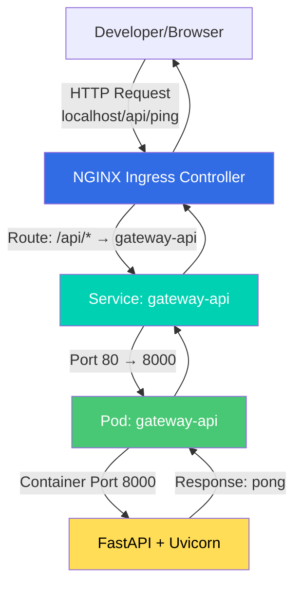
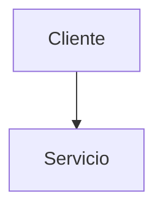

|                  |                                                                                         |
| ---------------- | --------------------------------------------------------------------------------------- |
| **Project Name** | MCP POC Monorepo                                                                        |
| **Description**  | Monorepo multi-servicio con arquitectura de microservicios, k8s, y desarrollo con Tilt |
| **Stack**        | Python (FastAPI), Kubernetes, Docker, Tilt, Redis Streams                               |
| **Location**     | `/Users/luisepifanio/Repos/mcp-poc`                                                     |
| **Version**      | v0.1.0-alpha                                                                            |
| **Last Updated** | 2026-01-09                                                                              |

---

# MCP POC Monorepo - Development Guide

Este documento es la **guía de entrada principal** para desarrolladores humanos y agentes IA que trabajen en el monorepo. Proporciona una visión general de la estructura, setup inicial, y delega en documentación especializada de cada proyecto.

---

## 🎯 Objetivos del Monorepo

1. **Desarrollo local integrado**: Usar Tilt + k8s (Docker Desktop) para simular entorno productivo
2. **Arquitectura modular**: Microservicios independientes con sus propias responsabilidades
3. **Deployment unificado**: Un solo `tilt up` levanta toda la infraestructura
4. **Path to production**: Preparación para GKE/AWS con configuraciones portables

---

## 📋 Quick Start - Setup Completo

### Pre-requisitos

- **Docker Desktop** con Kubernetes habilitado
- **Python 3.12+** instalado
- **uv** (package manager de Python): `curl -LsSf https://astral.sh/uv/install.sh | sh`
- **Tilt**: `curl -fsSL https://raw.githubusercontent.com/tilt-dev/tilt/master/scripts/install.sh | bash`
- **kubectl** (viene con Docker Desktop)

### Verificación del Entorno

```bash
# Verificar que todo esté instalado
docker --version
kubectl version --client
python3 --version
uv --version
tilt version

# Verificar que k8s esté corriendo
kubectl cluster-info
kubectl get nodes
```

### Setup Inicial del Monorepo

```bash
# 1. Clonar el repositorio
git clone <repo-url>
cd mcp-poc

# 2. (Opcional) Configurar dominio local
sudo ./scripts/setup-local-hosts.sh
# Esto configura app-local.hades.ar y refresca DNS cache

# 3. Levantar toda la infraestructura con Tilt
tilt up

# 4. Abrir Tilt UI en el navegador (se abre automáticamente)
# URL: http://localhost:10350

# 5. Verificar que todo funcione
curl http://localhost/api/ping
# Debería responder: "pong"

# Si configuraste el dominio local:
curl http://app-local.hades.ar/api/ping
```

### Detener el Entorno

```bash
# Detener Tilt (desde la UI presiona 'q' o desde terminal)
tilt down
```

---

## 🏗️ Estructura del Monorepo

```
mcp-poc/
├── gateway-api/              # 🌐 API Gateway (FastAPI)
│   ├── app/                  # Código fuente con Clean Architecture
│   ├── tests/                # Tests unitarios y funcionales
│   ├── pyproject.toml        # Dependencias
│   ├── Dockerfile            # Build del servicio
│   ├── Agents.md             # 📘 Guía específica del proyecto
│   └── README.md
│
├── mcpserver/                # 🔧 MCP Server Backend (FastAPI)
│   ├── app/                  # Código fuente con Clean Architecture
│   ├── tests/                # Tests unitarios y funcionales
│   ├── pyproject.toml        # Dependencias
│   ├── Dockerfile            # Build del servicio
│   ├── Agents.md             # 📘 Guía específica del proyecto
│   └── README.md
│
├── mcpagent/                 # 🤖 Agent runner y tooling
│   ├── pyproject.toml
│   └── README.md
│
├── k8s/                      # ☸️ Manifiestos de Kubernetes
│   ├── gateway-api.yaml      # Deployment + Service + ConfigMap
│   └── ingress.yaml          # NGINX Ingress
│
├── scripts/                  # 🔨 Scripts de automatización
│   └── setup-local-hosts.sh  # Configuración de dominio local
│
├── docs/                     # 📚 Documentación global
│   ├── SETUP.md              # Guía de setup detallada
│   ├── ARCHITECTURE.md       # Visión arquitectónica
│   └── DEPLOYMENT.md         # Estrategias de deployment
│
├── Tiltfile                  # 🎯 Configuración de Tilt (orquestación dev)
├── docker-compose.yml        # Alternativa a k8s para dev rápido
├── Agents.md                 # 📘 Este documento (monorepo-level)
└── README.md                 # Overview general del proyecto
```

---

## 🚀 Proyectos del Monorepo

### 1. Gateway API (`gateway-api/`)

**Responsabilidad**: API Gateway que maneja autenticación, routing, y exposición de endpoints públicos.

**Tech Stack**: Python 3.12, FastAPI, Clean Architecture

**Documentación**: Ver [gateway-api/Agents.md](gateway-api/Agents.md)

**Quick Commands**:
```bash
cd gateway-api
uv sync --group dev          # Instalar dependencias
uv run fastapi dev           # Ejecutar en modo desarrollo
uv run pytest                # Ejecutar tests
```

---

### 2. MCP Server (`mcpserver/`)

**Responsabilidad**: Backend de procesamiento de eventos, scraping, y lógica de negocio core.

**Tech Stack**: Python 3.12, FastAPI, SQLAlchemy, Scrapy, Clean Architecture

**Documentación**: Ver [mcpserver/Agents.md](mcpserver/Agents.md)

**Quick Commands**:
```bash
cd mcpserver
uv sync --group dev          # Instalar dependencias
uv run fastapi dev           # Ejecutar en modo desarrollo
uv run pytest                # Ejecutar tests
```

---

### 3. MCP Agent (`mcpagent/`)

**Responsabilidad**: Agentes y herramientas de automatización.

**Documentación**: Ver [mcpagent/README.md](mcpagent/README.md)

---

## 🛠️ Workflows de Desarrollo

### Desarrollo Local con Tilt

**Opción 1: Desarrollo con k8s (recomendado)**
```bash
# Levantar toda la infra
tilt up

# Tilt detecta cambios automáticamente y reconstruye
# Editar código → guardar → ver rebuild en Tilt UI
```

**Opción 2: Desarrollo de un servicio en aislamiento**
```bash
cd gateway-api
uv run fastapi dev           # Hot-reload local sin k8s
```

**Opción 3: Docker Compose (más simple pero menos realista)**
```bash
docker-compose up            # Servicios sin k8s
```

### Testing

**Tests de un proyecto específico**:
```bash
cd gateway-api
uv run pytest                # Todos los tests
uv run pytest tests/unit     # Solo unitarios
uv run pytest tests/functional  # Solo funcionales
uv run pytest -v --cov       # Con coverage
```

**Tests de todo el monorepo** (CI):
```bash
# Ejecutar desde la raíz
./scripts/run-all-tests.sh   # (TODO: crear este script)
```

### Linting y Type Checking

Cada proyecto tiene su propia configuración en `pyproject.toml`:

```bash
cd gateway-api
uv run ruff check .          # Lint
uv run ruff format .         # Format
uv run mypy app              # Type checking
```

---

## 🌐 Networking y Acceso

### Arquitectura de Red Local



**Componentes**:
- **NGINX Ingress Controller**: Instalado automáticamente por Tilt, routing L7
- **Service (ClusterIP)**: Abstracción sobre pods, port mapping 80→8000
- **Pod**: Instancia del contenedor gateway-api
- **FastAPI**: Aplicación web corriendo en puerto 8000

### Endpoints Disponibles

#### Servicios HTTP Públicos

| Endpoint                             | Descripción          | Requiere Auth |
| ------------------------------------ | -------------------- | ------------- |
| `http://localhost/api/ping`          | Health check         | No            |
| `http://app-local.hades.ar/api/ping` | Health check (alias) | No            |

#### Servicios Internos (Solo dentro del cluster)

| Servicio | DNS Interno | Puerto | Propósito |
|----------|-------------|--------|-----------|
| gateway-api | `gateway-api.default.svc.cluster.local` | 80 | API Gateway |
| redis-stream | `redis-stream.default.svc.cluster.local` | 6379 | Event streaming |

**Acceso a Redis desde fuera del cluster** (solo para debugging):
```bash
# Port forward temporal
kubectl port-forward svc/redis-stream 6379:6379

# En otra terminal
redis-cli -h localhost -p 6379 PING
```

---

## 📚 Documentación Detallada

### Para desarrolladores nuevos:
1. **Empieza aquí**: Este `Agents.md`
2. **Setup detallado**: [docs/SETUP.md](docs/SETUP.md)
3. **Arquitectura**: [docs/ARCHITECTURE.md](docs/ARCHITECTURE.md)

### Para desarrollo en proyectos específicos:
- **Gateway API**: [gateway-api/Agents.md](gateway-api/Agents.md)
- **MCP Server**: [mcpserver/Agents.md](mcpserver/Agents.md)

### Para deployment:
- **Estrategias de deployment**: [docs/DEPLOYMENT.md](docs/DEPLOYMENT.md)

---

## 📝 Convenciones de Documentación

- Diagramas en Mermaid: Todos los diagramas deben expresarse utilizando Mermaid (obligatorio). Motivo: es texto estructurado, versionable y fácil de revisar en PRs.

Ejemplo mínimo:



---

## 🐛 Troubleshooting Común

### "curl localhost/api/ping no funciona"

**Problema**: NGINX Ingress Controller no está instalado

**Solución**:
```bash
# Verificar que el ingress controller esté corriendo
kubectl get pods -n ingress-nginx

# Si no existe, Tilt debería instalarlo automáticamente
# Si falla, instalar manualmente (usar provider 'kind' para Docker Desktop + KIND):
kubectl apply -f https://raw.githubusercontent.com/kubernetes/ingress-nginx/controller-v1.14.1/deploy/static/provider/kind/deploy.yaml

# Esperar a que esté ready
kubectl wait --namespace ingress-nginx \
  --for=condition=ready pod \
  --selector=app.kubernetes.io/component=controller \
  --timeout=120s
```

### "Error al buildear imagen Docker"

**Problema**: Dockerfile mal configurado o dependencias faltantes

**Solución**:
```bash
# Build manual para debug
cd gateway-api
docker build -t gateway-api:debug -f Dockerfile .

# Si falla, revisar logs y verificar:
# 1. pyproject.toml tiene todas las dependencias
# 2. uv.lock está actualizado
# 3. Dockerfile COPY paths son correctos
```

### "Pod en CrashLoopBackOff"

**Solución**:
```bash
# Ver logs del pod
kubectl logs -l app=gateway-api --tail=100

# Describir el pod para ver eventos
kubectl describe pod -l app=gateway-api

# Problemas comunes:
# - Puerto incorrecto en livenessProbe
# - Variables de entorno faltantes
# - Imagen no se buildeó correctamente
```

### "No puedo acceder a app-local.hades.ar"

**Causa**: DNS cache no actualizado después de modificar `/etc/hosts`.

**Solución**: Refrescar el DNS cache del sistema:

```bash
# macOS
sudo dscacheutil -flushcache
sudo killall -HUP mDNSResponder

# Linux (systemd-resolved)
sudo systemd-resolve --flush-caches

# Linux (NetworkManager)
sudo systemctl restart NetworkManager

# Verificar
curl http://app-local.hades.ar/api/ping
```

**Alternativa rápida**: Forzar resolución DNS sin flush:
```bash
curl --resolve app-local.hades.ar:80:127.0.0.1 http://app-local.hades.ar/api/ping
```

**Nota**: El script `./scripts/setup-local-hosts.sh` hace el flush automáticamente.

---

### "Redis Stream no está disponible"

**Síntomas**: Gateway API logs muestran errores de conexión a Redis.

**Verificación**:
```bash
# Ver estado del pod
kubectl get pods -l app=redis-stream

# Ver logs
kubectl logs -l app=redis-stream --tail=50

# Probar conectividad
kubectl exec -it deployment/redis-stream -- redis-cli PING
# Debería responder: PONG
```

**Causas comunes**:
1. Pod en estado CrashLoopBackOff
2. PersistentVolumeClaim no montado
3. ConfigMap o Secret faltante

**Solución**:
```bash
# Si el pod está en error, verificar logs
kubectl describe pod -l app=redis-stream

# Si falta el PVC, verificar
kubectl get pvc redis-stream-pvc
kubectl describe pvc redis-stream-pvc

# Re-crear todo el servicio si es necesario
kubectl delete -f k8s/redis-stream.yaml
kubectl apply -f k8s/redis-stream.yaml

# Verificar que Gateway API pueda conectarse
kubectl exec -it deployment/gateway-api -- sh
# Dentro del pod:
apk add redis  # Si redis-cli no está instalado
redis-cli -h redis-stream -p 6379 PING
```

---

### "Gateway API no puede conectarse a Redis"

**Problema**: Variables de entorno REDIS_HOST/REDIS_PORT no están configuradas.

**Verificación**:
```bash
# Ver env vars del pod gateway-api
kubectl exec deployment/gateway-api -- env | grep REDIS

# Debería mostrar:
# REDIS_HOST=redis-stream
# REDIS_PORT=6379
```

**Solución**:
```bash
# Verificar que ConfigMap existe
kubectl get configmap redis-stream-configuration

# Ver contenido
kubectl describe configmap redis-stream-configuration

# Si falta, aplicar manifiestos
kubectl apply -f k8s/redis-stream.yaml
kubectl rollout restart deployment/gateway-api
```

---

## 🔄 Flujo de Trabajo Recomendado

### Safe Points y Commits

**Definición de Safe Point**: Estado del proyecto donde:
1. ✅ Todas las features implementadas funcionan correctamente
2. ✅ Tests pasan (mínimo 75% coverage)
3. ✅ Documentación actualizada
4. ✅ Sin errores de linting o type checking
5. ✅ Sistema validado manualmente

**Proceso de Commit**:
```bash
# 1. Validar estado del sistema
./scripts/validate-setup.sh

# 2. Ejecutar tests
cd gateway-api && uv run pytest
cd ../mcpserver && uv run pytest

# 3. Linting y type checking
cd gateway-api
uv run ruff check . && uv run mypy app

# 4. Commit con mensaje descriptivo
git add .
git commit -F COMMIT_MESSAGE.md

# 5. Actualizar CHANGELOG
# Editar CHANGELOG.md con cambios

# 6. Push
git push origin main
```

**Frecuencia**: Después de cada milestone funcional o al final del día de trabajo.

---

### Para nuevas features

1. **Identificar el servicio afectado** (`gateway-api`, `mcpserver`, etc.)
2. **Leer el `Agents.md` específico del proyecto**
3. **Desarrollar localmente** (sin k8s primero)
   ```bash
   cd gateway-api
   uv run fastapi dev
   ```
4. **Escribir tests** (TDD preferido)
5. **Validar con k8s**
   ```bash
   tilt up  # Verificar integración
   ```
6. **Commit + PR** siguiendo convenciones del proyecto

### Para debugging de integración

1. **Levantar Tilt**: `tilt up`
2. **Abrir Tilt UI**: http://localhost:10350
3. **Ver logs en tiempo real** de cada servicio
4. **Hacer cambios** → Tilt rebuilds automáticamente
5. **Probar endpoints** con curl o Postman

---

## 🌟 Principios del Monorepo

1. **Independencia de proyectos**: Cada proyecto tiene su `pyproject.toml`, venv, y ciclo de vida
2. **Documentación distribuida**: `Agents.md` global + específicos por proyecto
3. **Testing aislado**: Tests se ejecutan por proyecto, no globalmente (a menos que sea CI)
4. **Deployment unificado**: Tilt orquesta todo, pero cada servicio es deployable independientemente
5. **Clean Architecture**: Todos los proyectos Python siguen el mismo patrón arquitectónico
6. **Type safety**: mypy strict mode obligatorio
7. **Linting estricto**: Ruff con reglas comunes en todos los proyectos
8. **Diagramas en Mermaid**: Todos los diagramas y flujos deben escribirse en Mermaid.

---

## 📞 Recursos Adicionales

- **Tilt Docs**: https://docs.tilt.dev/
- **Kubernetes Docs**: https://kubernetes.io/docs/
- **FastAPI Docs**: https://fastapi.tiangolo.com/
- **Docker Desktop k8s**: https://docs.docker.com/desktop/kubernetes/

---

## 🤝 Contribución

Ver guías de contribución específicas de cada proyecto:
- [gateway-api/Agents.md](gateway-api/Agents.md)
- [mcpserver/Agents.md](mcpserver/Agents.md)

Para cambios que afecten múltiples proyectos, coordinar PRs de forma atómica.

---

**¿Primer vez en el proyecto?** → Sigue la sección "Quick Start - Setup Completo" arriba 👆
