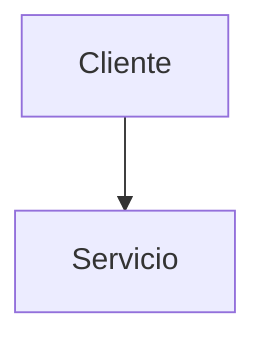

# MCP POC Monorepo

[](https://kubernetes.io/)
[](https://www.python.org/)
[](https://fastapi.tiangolo.com/)
[](https://tilt.dev/)

Monorepo multi-servicio con arquitectura de microservicios, Kubernetes, y desarrollo integrado con Tilt.

---

## 🚀 Quick Start

```bash
# 1. Verificar pre-requisitos
docker --version && kubectl version --client && uv --version && tilt version

# 2. (Opcional) Configurar dominio local
sudo ./scripts/setup-local-hosts.sh

# 3. Levantar toda la infraestructura
tilt up

# 4. Probar que funcione
curl http://localhost/api/ping
# Respuesta esperada: "pong"

# Con dominio local configurado:
curl http://app-local.hades.ar/api/ping
```

**Listo!** Tilt UI se abrirá en http://localhost:10350

---

## 📖 Documentación

### Para empezar:
- **[📘 Agents.md](Agents.md)** - Guía principal del monorepo (START HERE)
- **[🔧 Setup Guide](docs/SETUP.md)** - Instalación paso a paso
- **[🏗️ Architecture](docs/ARCHITECTURE.md)** - Visión arquitectónica
- **[🚀 Deployment](docs/DEPLOYMENT.md)** - Estrategias de deployment
- **[📊 Resumen Infra](docs/INFRASTRUCTURE_SETUP_SUMMARY.md)** - Cambios recientes

### Guías internas
- **[Pre-commit Checklist](PRE_COMMIT_CHECKLIST.md)**
- **[Roadmap](ROADMAP.md)**
- **[Changelog](CHANGELOG.md)**
- **Plantillas de commit**: [COMMIT_MESSAGE.md](COMMIT_MESSAGE.md), [COMMIT_MESSAGE_DNS.md](COMMIT_MESSAGE_DNS.md)

### Documentación por proyecto:
- **[Gateway API](gateway-api/Agents.md)** - API Gateway (FastAPI)
- **[MCP Server](mcpserver/Agents.md)** - Backend de procesamiento
- **[MCP Agent](mcpagent/README.md)** - Agentes y tooling

---

## 📝 Convenciones de Documentación

- Diagramas en Mermaid: Todos los diagramas deben expresarse utilizando Mermaid (obligatorio). Motivo: es texto estructurado, versionable y fácil de revisar en PRs.

Ejemplo mínimo:



---

## 🏗️ Estructura

```
mcp-poc/
├── gateway-api/      # 🌐 API Gateway (FastAPI + Clean Architecture)
├── mcpserver/        # 🔧 Backend de procesamiento (FastAPI + SQLAlchemy)
├── mcpagent/         # 🤖 Agentes y herramientas
├── k8s/              # ☸️  Manifiestos de Kubernetes
├── docs/             # 📚 Documentación global
├── scripts/          # 🔨 Scripts de automatización
├── Tiltfile          # 🎯 Orquestación de desarrollo
└── Agents.md         # 📘 Guía principal
```

---

## 🛠️ Stack Tecnológico

| Capa            | Tecnología             |
| --------------- | ---------------------- |
| **Lenguaje**    | Python 3.12+           |
| **Framework**   | FastAPI + Uvicorn      |
| **ORM**         | SQLAlchemy + SQLModel  |
| **Orquestación**| Kubernetes + Tilt      |
| **Routing**     | NGINX Ingress          |
| **Containers**  | Docker + uv            |
| **Testing**     | pytest                 |
| **Linting**     | Ruff + mypy            |

---

## 🎯 Workflows de Desarrollo

### Desarrollo con Tilt (Recomendado)

```bash
# Levantar toda la infra
tilt up

# Editar código → Auto-rebuild en Tilt
# Ver logs en tiempo real en Tilt UI: http://localhost:10350

# Detener
tilt down
```

### Desarrollo de un Servicio Aislado

```bash
cd gateway-api
uv sync --group dev
uv run fastapi dev  # Hot-reload local sin k8s
```

### Testing

```bash
cd gateway-api
uv run pytest                # Todos los tests
uv run pytest tests/unit     # Solo unitarios
uv run pytest -v --cov       # Con coverage
```

### Linting

```bash
cd gateway-api
uv run ruff check .          # Lint
uv run ruff format .         # Format
uv run mypy app              # Type checking
```

---

## 🌐 Endpoints Disponibles

| URL                                  | Descripción    | Servicio    |
| ------------------------------------ | -------------- | ----------- |
| `http://localhost/api/ping`          | Health check   | gateway-api |
| `http://app-local.hades.ar/api/ping` | Health check   | gateway-api |
| `http://localhost:10350`             | Tilt UI        | -           |
| `http://localhost:8000` (port-fwd)   | Gateway API    | gateway-api |

---

## 🧪 Verificación del Setup

```bash
# 1. Ver pods corriendo
kubectl get pods

# 2. Ver ingress controller
kubectl get pods -n ingress-nginx

# 3. Probar endpoint
curl http://localhost/api/ping

# 4. Ver logs
kubectl logs -l app=gateway-api --tail=50 -f
```

---

## 🐛 Troubleshooting

### "curl localhost/api/ping no funciona"

```bash
# Verificar NGINX Ingress Controller
kubectl get pods -n ingress-nginx

# Si no existe, instalar (Docker Desktop con KIND):
kubectl apply -f https://raw.githubusercontent.com/kubernetes/ingress-nginx/controller-v1.14.1/deploy/static/provider/kind/deploy.yaml
```

### "Pod en CrashLoopBackOff"

```bash
# Ver logs del pod
kubectl logs -l app=gateway-api --tail=100

# Describir pod
kubectl describe pod -l app=gateway-api
```

### Más troubleshooting

Ver [docs/SETUP.md](docs/SETUP.md#troubleshooting)

---

## 📦 Requisitos del Sistema

### Software

- **Docker Desktop** con Kubernetes habilitado
- **Python 3.12+**
- **uv** (package manager): `curl -LsSf https://astral.sh/uv/install.sh | sh`
- **Tilt**: `curl -fsSL https://raw.githubusercontent.com/tilt-dev/tilt/master/scripts/install.sh | bash`
- **kubectl** (incluido con Docker Desktop)

### Hardware Recomendado

- **RAM**: 8GB mínimo, 16GB recomendado
- **Disco**: 20GB libres
- **CPU**: 4 cores recomendado

---

## 🤝 Contribución

1. **Leer documentación del proyecto**: Ver `gateway-api/Agents.md` o `mcpserver/Agents.md`
2. **Crear feature branch**: `git checkout -b feature/mi-feature`
3. **Desarrollar con tests**: TDD preferido
4. **Validar con Tilt**: `tilt up` para probar integración
5. **PR con tests y linting pasando**

---

## 📝 Principios del Monorepo

1. **Independencia**: Cada proyecto tiene su `pyproject.toml` y venv
2. **Clean Architecture**: 3 capas en todos los proyectos Python
3. **Type Safety**: mypy strict mode obligatorio
4. **Testing First**: Cobertura mínima 75%
5. **Documentación distribuida**: `Agents.md` global + específicos

---

## 📞 Recursos

- **Tilt Docs**: https://docs.tilt.dev/
- **Kubernetes Docs**: https://kubernetes.io/docs/
- **FastAPI Docs**: https://fastapi.tiangolo.com/
- **Clean Architecture**: https://blog.cleancoder.com/uncle-bob/2012/08/13/the-clean-architecture.html

---

## 📄 Licencia

[Especificar licencia]

---

**¿Primera vez en el proyecto?** → Lee [Agents.md](Agents.md) para la guía completa.


 