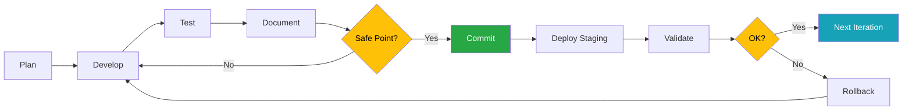

# Próximos Pasos - Post Safe Point

**Estado Actual**: ✅ Safe Point Alcanzado (2026-01-08)

La infraestructura base del monorepo está funcional y documentada. El siguiente commit marca el milestone de "Infrastructure Setup Complete".

---

## 📋 Safe Point Checklist

- [x] Infraestructura K8s funcional con NGINX Ingress
- [x] Gateway API deployable y accesible vía Ingress
- [x] Documentación completa del monorepo
- [x] Scripts de validación y setup
- [x] Diagramas con Mermaid para mejor visualización
- [x] Limitación de Docker Desktop documentada
- [x] Testing manual completado (`curl localhost/api/ping` → "pong")
- [x] CHANGELOG.md creado y actualizado

---

## 🎯 Roadmap - Próximas Iteraciones

### Iteración 1: Completar Servicios Core (1-2 semanas)

**Objetivos**:
- [ ] Agregar mcpserver al Tiltfile y k8s manifests
- [ ] Configurar comunicación inter-servicio (Gateway API → MCP Server)
- [ ] Implementar endpoints básicos de autenticación en Gateway API
- [ ] Agregar PostgreSQL/SQLite a mcpserver en k8s

**Entregables**:
- `k8s/mcpserver.yaml` con Deployment + Service
- Ingress rule para `/mcp/*` → mcpserver
- Tests E2E de comunicación entre servicios

---

### Iteración 2: Observabilidad y Monitoring (1 semana)

**Objetivos**:
- [ ] Integrar Prometheus para métricas
- [ ] Configurar Grafana dashboards
- [ ] Implementar structured logging (JSON)
- [ ] Agregar tracing básico (OpenTelemetry futuro)

**Entregables**:
- `k8s/monitoring/` con Prometheus + Grafana manifests
- Dashboards para request rate, latency, error rate
- Scripts de setup de monitoring

---

### Iteración 3: CI/CD Pipeline (1 semana)

**Objetivos**:
- [ ] Configurar GitHub Actions para tests automáticos
- [ ] Setup de staging environment (GKE o AWS)
- [ ] Pipeline de build → test → deploy
- [ ] Smoke tests automáticos post-deployment

**Entregables**:
- `.github/workflows/ci.yml` - Tests en PRs
- `.github/workflows/deploy-staging.yml` - Deploy automático
- Documentación de proceso de release

---

### Iteración 4: Security y Secrets Management (1 semana)

**Objetivos**:
- [ ] Implementar Sealed Secrets o External Secrets Operator
- [ ] Configurar SSL/TLS con cert-manager
- [ ] Network Policies entre servicios
- [ ] RBAC en k8s

**Entregables**:
- Secrets encriptados en repo
- Certificados SSL automáticos con Let's Encrypt
- Documentación de security best practices

---

### Iteración 5: Performance y Scaling (1 semana)

**Objetivos**:
- [ ] Configurar HPA (Horizontal Pod Autoscaler)
- [ ] Implementar Redis para caching
- [ ] Optimizar imágenes Docker
- [ ] Load testing y benchmarking

**Entregables**:
- HPA configurado para gateway-api y mcpserver
- Redis integrado en arquitectura
- Documentación de performance tuning

---

## 🚀 Quick Wins Paralelos

Tareas pequeñas que se pueden hacer en paralelo:

- [ ] Agregar badges al README.md (build status, coverage)
- [ ] Configurar pre-commit hooks (ruff, mypy)
- [ ] Crear script `run-all-tests.sh` para CI
- [ ] Agregar health check endpoint mejorado (`/health` con detalles)
- [ ] Documentar arquitectura de datos (ERD) en mcpserver
- [ ] Crear Docker Compose alternativo para desarrollo rápido

---

## 📊 Métricas de Éxito

Para cada iteración, validar:

1. **Funcionalidad**: Feature funciona end-to-end
2. **Tests**: Cobertura ≥75%
3. **Documentación**: Actualizada en Agents.md y docs/
4. **Performance**: Latency p99 <1s para requests simples
5. **Observabilidad**: Logs, métricas y traces disponibles

---

## 🔄 Proceso de Iteración

---

## 🤝 Contribución

Para contribuir a las próximas iteraciones:

1. **Revisar roadmap** en este documento
2. **Asignar tarea** del backlog
3. **Crear branch**: `feature/nombre-feature`
4. **Desarrollar** siguiendo TDD y Clean Architecture
5. **Documentar** en Agents.md específico
6. **PR** con tests y documentación
7. **Merge** después de review

---

## 📝 Notas

- Cada iteración debe alcanzar un safe point antes de commit
- Mantener documentación actualizada en cada cambio
- Usar Mermaid para diagramas nuevos
- Validar con `./scripts/validate-setup.sh` antes de commit
- Actualizar CHANGELOG.md en cada release

---

**Último Safe Point**: 2026-01-08 - Infrastructure Setup Complete  
**Próximo Milestone**: Servicios Core Integrados (Iteración 1)
