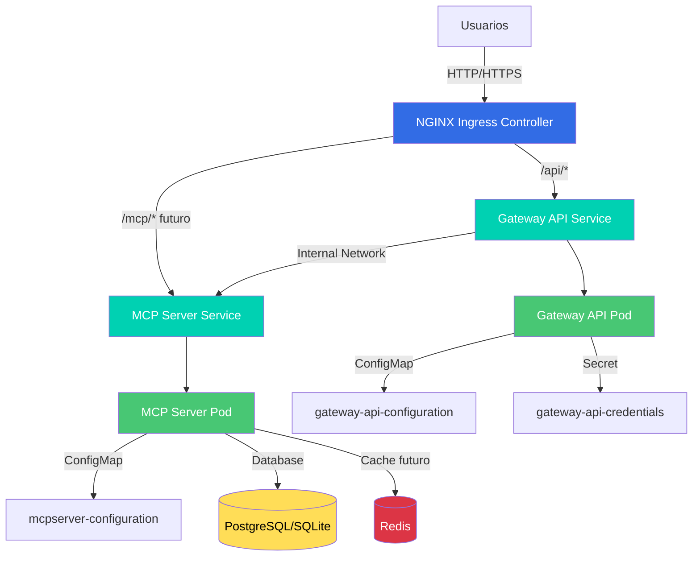

# Architecture - MCP POC Monorepo

Esta guía describe la arquitectura general del monorepo y los principios de diseño aplicados.

---

## 📋 Tabla de Contenidos

1. [Visión General](#visión-general)
2. [Arquitectura de Microservicios](#arquitectura-de-microservicios)
3. [Networking y Comunicación](#networking-y-comunicación)
4. [Clean Architecture por Servicio](#clean-architecture-por-servicio)
5. [Deployment y Orquestación](#deployment-y-orquestación)
6. [Principios de Diseño](#principios-de-diseño)

---

## Visión General

### Stack Tecnológico Global

| Capa            | Tecnología             | Propósito                          |
| --------------- | ---------------------- | ---------------------------------- |
| **Lenguaje**    | Python 3.12+           | Runtime principal                  |
| **Web**         | FastAPI + Uvicorn      | API REST framework                 |
| **Orquestación**| Kubernetes + Tilt      | Container orchestration + dev loop |
| **Routing**     | NGINX Ingress          | L7 load balancing                  |
| **Build**       | Docker + uv            | Containerization + deps            |
| **Testing**     | pytest                 | Unit + functional tests            |
| **Linting**     | Ruff + mypy            | Code quality + type safety         |

### Diagrama de Alto Nivel



**Leyenda**:
- **Azul**: Ingress Controller (routing L7)
- **Verde claro**: Services (abstracción k8s)
- **Verde**: Pods (contenedores aplicación)
- **Amarillo**: Base de datos
- **Rojo**: Caché (futuro)

---

## Arquitectura de Microservicios

### Servicios Actuales

#### 1. Gateway API

**Responsabilidades**:
- Autenticación y autorización
- Exposición de APIs públicas
- Rate limiting y throttling
- Request validation
- Response transformation

**Endpoints**:
- `GET /api/ping` - Health check
- `POST /api/auth/login` - Autenticación (futuro)
- `GET /api/auth/me` - Usuario actual (futuro)

**Tecnologías**:
- FastAPI + Uvicorn
- Clean Architecture (3 capas)
- Type safety con mypy strict

**Dependencias**:
- NGINX Ingress (upstream)
- MCP Server (downstream, futuro)

---

#### 2. MCP Server

**Responsabilidades**:
- Procesamiento de eventos
- Web scraping con Scrapy/Playwright
- Lógica de negocio core
- Persistencia de datos

**Endpoints** (internos):
- `POST /events` - Encolar evento
- `GET /events/{id}` - Obtener estado
- `GET /courses` - Listar cursos

**Tecnologías**:
- FastAPI + Uvicorn
- SQLAlchemy + SQLModel
- Scrapy + Playwright
- Clean Architecture (3 capas)

**Dependencias**:
- PostgreSQL/SQLite (datos)
- Redis (futuro, para colas)

---

### Servicios Futuros

#### 3. Notification Service (Planeado)

**Responsabilidades**:
- Envío de emails
- Push notifications
- SMS (opcional)

---

#### 4. Analytics Service (Planeado)

**Responsabilidades**:
- Métricas de uso
- Logs agregados
- Dashboards

---

## Networking y Comunicación

### Modelo de Comunicación

```
External Traffic (Port 80/443)
        │
        ↓
[NGINX Ingress Controller]
        │
        ├─→ /api/*      → gateway-api:80 → Pod:8000
        ├─→ /mcp/*      → mcpserver:80    → Pod:8000 (futuro)
        └─→ /analytics/* → analytics:80   → Pod:8000 (futuro)
```

### Service Mesh (Kubernetes Services)

#### Gateway API Service

```yaml
apiVersion: v1
kind: Service
metadata:
  name: gateway-api
spec:
  type: ClusterIP  # Internal only, exposed via Ingress
  ports:
    - port: 80           # Service port
      targetPort: 8000   # Container port
  selector:
    app: gateway-api
```

**Acceso**:
- Externo: `http://localhost/api/*` (via Ingress)
- Interno: `http://gateway-api.default.svc.cluster.local:80`

#### MCP Server Service (Futuro)

```yaml
apiVersion: v1
kind: Service
metadata:
  name: mcpserver
spec:
  type: ClusterIP
  ports:
    - port: 80
      targetPort: 8000
  selector:
    app: mcpserver
```

**Acceso**:
- Externo: `http://localhost/mcp/*` (via Ingress, si se expone)
- Interno: `http://mcpserver.default.svc.cluster.local:80`

### Comunicación Inter-Servicio

**Actual**: Ninguna (Gateway API es standalone)

**Futuro**: Gateway API → MCP Server
```python
# gateway-api/app/infrastructure/clients/mcpserver_client.py
import httpx

async def get_events():
    async with httpx.AsyncClient() as client:
        # Usar Service DNS interno
        response = await client.get(
            "http://mcpserver.default.svc.cluster.local:80/events"
        )
        return response.json()
```

**Patrón**: Async HTTP con circuit breaker (futuro: usar Istio o Linkerd)

---

## Clean Architecture por Servicio

Todos los servicios Python siguen el mismo patrón arquitectónico:

### Capas

```
┌─────────────────────────────────────────────────┐
│          Infrastructure Layer                   │
│  - FastAPI routers                              │
│  - Database adapters (SQLAlchemy)               │
│  - External clients (HTTP, Scrapy)              │
│  - Config loading                               │
└───────────────────┬─────────────────────────────┘
                    ↓ depends on
┌─────────────────────────────────────────────────┐
│           Use Cases Layer                       │
│  - Business logic orchestration                 │
│  - Transaction management (UnitOfWork)          │
│  - Input validation                             │
└───────────────────┬─────────────────────────────┘
                    ↓ depends on
┌─────────────────────────────────────────────────┐
│        Core / Domain Layer                      │
│  - Entities (pure Python dataclasses)           │
│  - Repository interfaces (ABC)                  │
│  - Domain exceptions                            │
│  - Business rules                               │
└─────────────────────────────────────────────────┘
```

### Flujo de una Request

```
1. HTTP Request
   ↓
2. FastAPI Router (infrastructure/api/routes/)
   ↓
3. Request validation (Pydantic)
   ↓
4. UseCase invocation (core/usecases/)
   ↓
5. Repository access via UnitOfWork (core/repositories.py → infrastructure/persistence/)
   ↓
6. Domain logic execution
   ↓
7. Response serialization (Pydantic)
   ↓
8. HTTP Response
```

### Dependency Injection

**Patrón**: FastAPI Depends + factory functions

```python
# infrastructure/api/dependencies.py
from app.core.usecases.event_usecases import EnqueueEventUseCase
from app.infrastructure.persistence.sql_unit_of_work import SqlUnitOfWork

def get_enqueue_event_usecase() -> EnqueueEventUseCase:
    uow = SqlUnitOfWork()
    return EnqueueEventUseCase(uow)

# infrastructure/api/routes/events.py
@router.post("/events")
async def enqueue_event(
    payload: EventPayload,
    usecase: EnqueueEventUseCase = Depends(get_enqueue_event_usecase)
):
    result = await usecase.execute(payload)
    return result
```

---

## Deployment y Orquestación

### Entorno de Desarrollo (Local)

**Herramienta**: Tilt + Docker Desktop Kubernetes

**Workflow**:
1. Developer ejecuta `tilt up`
2. Tilt instala NGINX Ingress Controller
3. Tilt construye imágenes Docker de cada servicio
4. Tilt aplica manifiestos k8s (`k8s/*.yaml`)
5. Tilt monitorea cambios y reconstruye automáticamente

**Ventajas**:
- Hot reload automático
- Logs centralizados en UI
- Simula entorno productivo
- Debug sencillo

**Desventajas**:
- Requiere recursos (6GB RAM mínimo)
- Startup lento en primera ejecución

---

### Entorno de Staging (Futuro)

**Plataforma**: GKE (Google Kubernetes Engine) o AWS EKS

**Pipeline CI/CD**:
```
Git Push → GitHub Actions
    ↓
Run Tests (pytest)
    ↓
Build Docker Images
    ↓
Push to Container Registry (GCR/ECR)
    ↓
Update k8s manifests (Kustomize)
    ↓
Apply to Staging Cluster
    ↓
Run Smoke Tests
    ↓
Notify Team (Slack)
```

**Infraestructura**:
- Managed Kubernetes (GKE/EKS)
- Cloud SQL (PostgreSQL)
- Redis (Memorystore/ElastiCache)
- Cloud Storage (GCS/S3)

---

### Entorno de Producción (Futuro)

**Diferencias con Staging**:
- **Replicas**: 3+ pods por servicio (HA)
- **Autoscaling**: HPA basado en CPU/memoria
- **Monitoring**: Prometheus + Grafana
- **Logging**: ELK Stack o Cloud Logging
- **Secrets**: Gestionados con Sealed Secrets o External Secrets Operator
- **SSL/TLS**: Cert-manager con Let's Encrypt
- **Backups**: Automáticos diarios de BD

---

## Principios de Diseño

### 1. Separation of Concerns

Cada microservicio tiene una responsabilidad clara y acotada. No hay código compartido entre servicios (excepto contratos de API).

### 2. Dependency Inversion

Todos los servicios dependen de abstracciones (interfaces ABC), no de implementaciones concretas.

```python
# ✅ Correcto
class EnqueueEventUseCase:
    def __init__(self, uow: UnitOfWork):  # Abstracción
        self.uow = uow

# ❌ Incorrecto
class EnqueueEventUseCase:
    def __init__(self):
        self.uow = SqlUnitOfWork()  # Implementación concreta
```

### 3. Configuration as Code

Toda la infraestructura está definida en código (IaC):
- Kubernetes manifests en `k8s/`
- Tiltfile para orquestación dev
- Dockerfiles para builds reproducibles

### 4. Type Safety

Uso estricto de type hints y mypy en modo strict:

```python
# pyproject.toml
[tool.mypy]
strict = true
```

### 5. Testing First

Todo código debe tener tests:
- **Unit tests**: Lógica de negocio y use cases
- **Functional tests**: Endpoints de API

Cobertura mínima: 75%

### 6. Immutable Infrastructure

Containers son immutables. No se ejecutan comandos dentro de pods en producción.

### 7. Fail Fast

Validación temprana de inputs, errores explícitos, no atrapar excepciones sin justificación.

### 8. Observable

Logs estructurados (JSON), métricas (futuro: Prometheus), tracing (futuro: OpenTelemetry).

---

## Decisiones Arquitectónicas (ADRs)

### ADR-001: Usar Kubernetes para Desarrollo Local

**Contexto**: Necesitamos simular entorno productivo en desarrollo.

**Decisión**: Usar Docker Desktop Kubernetes + Tilt.

**Alternativas consideradas**:
- Docker Compose: Más simple pero no simula k8s
- Minikube: Requiere VM, más complejo
- k3s: Buena opción pero Docker Desktop es más integrado en macOS

**Consecuencias**:
- ✅ Paridad dev-prod
- ✅ Aprendizaje de k8s por developers
- ❌ Setup inicial más complejo
- ❌ Requiere más recursos

---

### ADR-002: NGINX Ingress Controller

**Contexto**: Necesitamos routing L7 en k8s.

**Decisión**: Usar NGINX Ingress Controller (oficial de k8s).

**Alternativas consideradas**:
- Traefik: Bueno pero menos adoptado
- Istio: Overkill para MVP, overhead alto

**Consecuencias**:
- ✅ Solución estándar de la industria
- ✅ Documentación abundante
- ✅ Path to production claro
- ❌ Requiere instalación adicional

---

### ADR-003: Monorepo vs Multirepo

**Contexto**: Gestionar múltiples microservicios.

**Decisión**: Monorepo con independencia de proyectos.

**Alternativas consideradas**:
- Multirepo: Más aislamiento pero más complejo coordinar cambios

**Consecuencias**:
- ✅ Fácil refactoring cross-service
- ✅ Versionamiento unificado
- ✅ CI/CD simplificado
- ❌ Posible acoplamiento accidental (mitigar con linting)

---

## Próximos Pasos Arquitectónicos

### Corto Plazo (Q1 2026)

1. **Service Mesh**: Evaluar Istio/Linkerd para comunicación inter-servicio
2. **Observability**: Integrar Prometheus + Grafana
3. **Secrets Management**: Implementar Sealed Secrets

### Mediano Plazo (Q2 2026)

1. **API Gateway Unificado**: Kong o Ambassador
2. **Message Queue**: Redis Streams o RabbitMQ
3. **Event Sourcing**: Para eventos de scraping

### Largo Plazo (Q3-Q4 2026)

1. **Multi-region**: Deployments en múltiples regiones
2. **CDN**: CloudFlare o Fastly para assets estáticos
3. **GraphQL Gateway**: Apollo Federation sobre REST APIs

---

## Referencias

- [Tilt Best Practices](https://docs.tilt.dev/tutorial.html)
- [Clean Architecture (Uncle Bob)](https://blog.cleancoder.com/uncle-bob/2012/08/13/the-clean-architecture.html)
- [12-Factor App](https://12factor.net/)
- [Kubernetes Patterns](https://www.redhat.com/en/resources/kubernetes-patterns-ebook)
