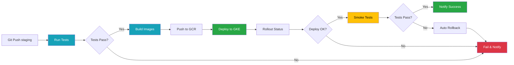

# Deployment Guide - MCP POC Monorepo

Esta guía describe las estrategias y procesos de deployment para el monorepo MCP POC.

---

## 📋 Tabla de Contenidos

1. [Entornos](#entornos)
2. [Estrategias de Deployment](#estrategias-de-deployment)
3. [Proceso de Deployment](#proceso-de-deployment)
4. [Rollback](#rollback)
5. [CI/CD Pipeline](#cicd-pipeline)
6. [Monitoreo Post-Deployment](#monitoreo-post-deployment)

---

## Entornos

### 1. Development (Local)

**Propósito**: Desarrollo activo, pruebas locales, debugging.

**Infraestructura**:
- Docker Desktop Kubernetes (1 node)
- NGINX Ingress Controller
- SQLite (gateway-api, mcpserver)

**Acceso**:
- `http://localhost/api/ping`
- `http://app-local.hades.ar/api/ping`

**Deployment**:
```bash
tilt up
```

**Características**:
- Hot reload automático
- Logs en Tilt UI
- Sin persistencia duradera (pods recreables)
- No requiere credenciales cloud

---

### 2. Staging (Futuro - GKE/AWS)

**Propósito**: Testing de integración, QA, pre-producción.

**Infraestructura** (Propuesta):
- GKE Cluster (3 nodes, e2-medium) o AWS EKS
- Cloud SQL PostgreSQL (db-f1-micro) o RDS
- Cloud Storage (GCS/S3) para backups
- Let's Encrypt SSL/TLS

**Acceso**:
- `https://staging.mcppoc.io/api/ping`

**Deployment**:
```bash
# Via GitHub Actions (automático en push a branch `staging`)
# O manual:
kubectl config use-context gke_project-id_region_staging-cluster
kubectl apply -k k8s/overlays/staging
```

**Características**:
- Replica de producción con menos recursos
- Datos sintéticos o anonimizados
- CI/CD automático
- Monitoreo básico (Cloud Monitoring)

---

### 3. Production (Futuro - GKE/AWS)

**Propósito**: Servicio a usuarios finales.

**Infraestructura** (Propuesta):
- GKE Cluster (3+ nodes, n1-standard-2) o AWS EKS
- Cloud SQL PostgreSQL (db-n1-standard-2, HA) o RDS Multi-AZ
- Redis (Memorystore/ElastiCache) para caching
- Cloud Storage para backups diarios
- CDN (Cloud CDN/CloudFlare) para assets

**Acceso**:
- `https://api.mcppoc.io/api/ping`

**Deployment**:
```bash
# Via GitHub Actions con aprobación manual
# O manual en emergencias:
kubectl config use-context gke_project-id_region_prod-cluster
kubectl apply -k k8s/overlays/production
```

**Características**:
- Alta disponibilidad (3+ replicas por servicio)
- Horizontal Pod Autoscaler (HPA)
- Backups automáticos diarios
- Monitoreo avanzado (Prometheus + Grafana)
- Alertas (PagerDuty/Slack)

---

## Estrategias de Deployment

### Rolling Update (Default)

**Descripción**: k8s reemplaza pods gradualmente sin downtime.

**Configuración**:
```yaml
# k8s/gateway-api.yaml
spec:
  replicas: 3
  strategy:
    type: RollingUpdate
    rollingUpdate:
      maxUnavailable: 1  # Max 1 pod down a la vez
      maxSurge: 1        # Max 1 pod extra durante update
```

**Proceso**:
1. k8s crea 1 nuevo pod con nueva versión
2. Espera a que esté Ready (readinessProbe)
3. Termina 1 pod viejo
4. Repite hasta completar

**Ventajas**:
- ✅ Zero downtime
- ✅ Rollback automático si falla readinessProbe

**Desventajas**:
- ❌ Versiones mezcladas temporalmente

**Uso**: Default para todos los servicios.

---

### Blue-Green Deployment (Futuro)

**Descripción**: Desplegar nueva versión en paralelo, cambiar tráfico instantáneamente.

**Implementación** (Propuesta con Istio):
```yaml
apiVersion: networking.istio.io/v1beta1
kind: VirtualService
metadata:
  name: gateway-api
spec:
  hosts:
    - gateway-api
  http:
    - weight: 100
      route:
        - destination:
            host: gateway-api
            subset: v1  # Blue (versión actual)
    # Cambiar a v2 (green) cuando esté listo:
    # - weight: 100
    #   route:
    #     - destination:
    #         host: gateway-api
    #         subset: v2
```

**Ventajas**:
- ✅ Cambio instantáneo
- ✅ Rollback inmediato (cambiar weight)
- ✅ Testing en producción con tráfico real

**Desventajas**:
- ❌ Requiere doble de recursos temporalmente
- ❌ Complejidad adicional

**Uso**: Releases críticos con alto riesgo.

---

### Canary Deployment (Futuro)

**Descripción**: Liberar nueva versión a % pequeño de usuarios, aumentar gradualmente.

**Implementación** (Propuesta con Istio):
```yaml
apiVersion: networking.istio.io/v1beta1
kind: VirtualService
metadata:
  name: gateway-api
spec:
  hosts:
    - gateway-api
  http:
    - weight: 90
      route:
        - destination:
            host: gateway-api
            subset: v1  # Versión estable
    - weight: 10
      route:
        - destination:
            host: gateway-api
            subset: v2  # Canary (nueva versión)
```

**Proceso**:
1. Deploy v2 con 10% tráfico
2. Monitorear métricas (error rate, latency)
3. Si OK, aumentar a 50%
4. Si OK, aumentar a 100%
5. Remover v1

**Ventajas**:
- ✅ Bajo riesgo
- ✅ Feedback temprano
- ✅ Rollback granular

**Desventajas**:
- ❌ Requiere service mesh (Istio/Linkerd)
- ❌ Más lento que blue-green

**Uso**: Features nuevas con impacto incierto.

---

## Proceso de Deployment

### Desarrollo Local

**Trigger**: `tilt up` o cambios en código

**Steps**:
1. Tilt detecta cambios en archivos
2. Rebuilds imagen Docker
3. Aplica manifiestos k8s
4. Espera a que pod esté Ready
5. Forward logs a UI

**Rollback**: `tilt down`, revertir cambios en código, `tilt up`

---

### Staging (Futuro - Automático)

**Trigger**: Push a branch `staging` en GitHub

**Pipeline** (GitHub Actions):


**Duración estimada**: 5-10 minutos

**Notificaciones**: Slack al completar o fallar

---

### Production (Futuro - Manual Approval)

**Trigger**: Tag Git `v*.*.*` (ej: `v1.0.0`)

**Pipeline** (GitHub Actions):
```yaml
name: Deploy to Production

on:
  push:
    tags:
      - 'v*.*.*'

jobs:
  # ... (mismo test + build que staging)

  deploy:
    needs: build
    runs-on: ubuntu-latest
    environment:
      name: production
      url: https://api.mcppoc.io
    steps:
      - name: Deploy to GKE
        run: |
          gcloud container clusters get-credentials prod-cluster
          kubectl set image deployment/gateway-api \
            gateway-api=gcr.io/project/gateway-api:${{ github.sha }}
          kubectl rollout status deployment/gateway-api --timeout=10m

  post-deploy:
    needs: deploy
    runs-on: ubuntu-latest
    steps:
      - name: Smoke tests
        run: curl -f https://api.mcppoc.io/api/ping || exit 1
      - name: Notify team
        run: |
          # Post to Slack
          curl -X POST ${{ secrets.SLACK_WEBHOOK }} \
            -d '{"text":"🚀 Production deployed: ${{ github.ref }}"}'
```

**Aprobación manual**: Requerida en GitHub (Settings → Environments → production → Required reviewers)

**Duración estimada**: 10-15 minutos

---

## Rollback

### Desarrollo Local

```bash
# Opción 1: Revertir cambios en código
git checkout HEAD~1 -- gateway-api/

# Opción 2: Rebuild imagen anterior
tilt down
git reset --hard HEAD~1
tilt up
```

---

### Staging/Production

**Opción 1: Kubectl Rollback (Rápido)**
```bash
# Ver historial de deployments
kubectl rollout history deployment/gateway-api

# Rollback a revisión anterior
kubectl rollout undo deployment/gateway-api

# O a revisión específica
kubectl rollout undo deployment/gateway-api --to-revision=3

# Verificar status
kubectl rollout status deployment/gateway-api
```

**Duración**: 1-2 minutos

---

**Opción 2: Git Revert + Re-deploy (Seguro)**
```bash
# Revertir commit problemático
git revert <commit-sha>
git push origin main

# Trigger CI/CD automático
# O manual:
git tag v1.0.1  # Nueva versión con fix
git push origin v1.0.1
```

**Duración**: 5-10 minutos

---

**Opción 3: Blue-Green Instant Rollback** (Futuro)
```bash
# Cambiar tráfico a versión anterior
istioctl virtual-service update gateway-api --subset=v1 --weight=100

# Verificar
curl https://api.mcppoc.io/api/ping
```

**Duración**: <1 minuto

---

## CI/CD Pipeline

### Estructura de Branches

```
main            # Branch protegido, production-ready
  ├── staging   # Pre-production, auto-deploy a staging
  └── feature/* # Feature branches, CI checks only
```

### Pull Request Checks

**Obligatorios**:
1. ✅ All tests pass (pytest)
2. ✅ Linting pass (ruff check)
3. ✅ Type checking pass (mypy)
4. ✅ Code coverage ≥75%
5. ✅ 1+ approvals from CODEOWNERS

**GitHub Actions Workflow**:
```yaml
name: PR Checks

on:
  pull_request:
    branches: [main, staging]

jobs:
  test-gateway-api:
    runs-on: ubuntu-latest
    steps:
      - uses: actions/checkout@v3
      - uses: actions/setup-python@v4
        with:
          python-version: '3.12'
      - name: Install uv
        run: curl -LsSf https://astral.sh/uv/install.sh | sh
      - name: Install deps
        run: cd gateway-api && uv sync --group dev
      - name: Lint
        run: cd gateway-api && uv run ruff check .
      - name: Type check
        run: cd gateway-api && uv run mypy app
      - name: Test
        run: cd gateway-api && uv run pytest --cov --cov-fail-under=75

  test-mcpserver:
    # ... (similar a gateway-api)
```

---

### Release Process

**1. Crear Release Branch**
```bash
git checkout -b release/v1.0.0
```

**2. Bump Version**
```bash
# En cada proyecto
cd gateway-api
./scripts/version.sh patch  # major | minor | patch
cd ../mcpserver
./scripts/version.sh patch
```

**3. Update CHANGELOG**
```bash
# Agregar entries en gateway-api/CHANGELOG.md, mcpserver/CHANGELOG.md
```

**4. Merge a Staging**
```bash
git checkout staging
git merge release/v1.0.0
git push origin staging
# Esperar deploy automático a staging
```

**5. Testing en Staging**
```bash
# Manual testing
curl https://staging.mcppoc.io/api/ping

# Automated E2E tests (futuro)
pytest tests/e2e
```

**6. Merge a Main + Tag**
```bash
git checkout main
git merge release/v1.0.0
git tag v1.0.0
git push origin main v1.0.0
# Requiere aprobación manual para deploy a prod
```

**7. Monitor Production**
```bash
# Ver logs
kubectl logs -f deployment/gateway-api

# Ver métricas
# Abrir Grafana dashboard
```

---

## Monitoreo Post-Deployment

### Health Checks

**Liveness Probe** (k8s):
```yaml
livenessProbe:
  httpGet:
    path: /ping
    port: 8000
  initialDelaySeconds: 5
  periodSeconds: 10
  failureThreshold: 3
```

**Readiness Probe** (k8s):
```yaml
readinessProbe:
  httpGet:
    path: /ping
    port: 8000
  initialDelaySeconds: 3
  periodSeconds: 5
  failureThreshold: 2
```

**External Monitoring** (Futuro):
- UptimeRobot: Check cada 5 min
- Pingdom: Check desde múltiples regiones

---

### Métricas Clave (SLIs)

| Métrica          | Threshold | Alerta Si           |
| ---------------- | --------- | ------------------- |
| Request Rate     | -         | Drop >50%           |
| Error Rate       | <1%       | >5% por 5min        |
| Latency (p50)    | <100ms    | >500ms por 5min     |
| Latency (p99)    | <1s       | >5s por 5min        |
| Pod Restart Rate | <1/hour   | >3 en 10min         |
| CPU Usage        | <70%      | >90% por 5min       |
| Memory Usage     | <80%      | >95% por 5min       |

---

### Dashboards (Futuro - Grafana)

**Production Dashboard**:
- Request rate (requests/sec)
- Error rate (%)
- Latency percentiles (p50, p90, p99)
- Pod status (running, pending, failed)
- Resource usage (CPU, memory)

**Deployment Dashboard**:
- Deployment history timeline
- Rollback events
- Failed deployments
- Deployment duration

---

### Alertas (Futuro - PagerDuty/Slack)

**Severidad**:
- **P1 (Critical)**: Production down, immediate action
  - All pods down
  - Error rate >20%
- **P2 (High)**: Degraded performance
  - Error rate >5%
  - Latency p99 >5s
- **P3 (Low)**: Warning
  - Deployment failed
  - CPU >90%

**Canales**:
- P1 → PagerDuty (on-call)
- P2/P3 → Slack #alerts

---

## Checklist Pre-Deployment

### Staging

- [ ] Todos los tests pasan (unit + functional)
- [ ] Linting y type checking OK
- [ ] Code review aprobado
- [ ] CHANGELOG actualizado
- [ ] Version bumpeada
- [ ] Migrations de BD testeadas (si aplica)

### Production

- [ ] Todo de staging ✓
- [ ] Testing manual en staging completado
- [ ] Smoke tests automáticos pasan
- [ ] Backup de BD reciente (<24h)
- [ ] Rollback plan documentado
- [ ] Stakeholders notificados
- [ ] Ventana de mantenimiento comunicada (si aplica)
- [ ] On-call engineer identificado

---

## Troubleshooting Post-Deployment

### "Deployment stuck at X% rollout"

**Diagnóstico**:
```bash
kubectl rollout status deployment/gateway-api
kubectl describe deployment gateway-api
kubectl get events --sort-by='.lastTimestamp'
```

**Causas comunes**:
- Readiness probe falla
- Imagen no disponible
- Resources insuficientes

**Solución**:
```bash
# Ver logs del pod nuevo
kubectl logs deployment/gateway-api --tail=100

# Rollback
kubectl rollout undo deployment/gateway-api
```

---

### "Error rate spike post-deployment"

**Diagnóstico**:
```bash
# Ver logs con errores
kubectl logs -l app=gateway-api | grep ERROR

# Ver métricas
kubectl top pods
```

**Solución inmediata**:
```bash
# Rollback
kubectl rollout undo deployment/gateway-api
```

**Solución a largo plazo**:
- Implementar canary deployments
- Mejorar testing

---

## Referencias

- [Kubernetes Deployment Strategies](https://kubernetes.io/docs/concepts/workloads/controllers/deployment/)
- [GitOps Best Practices](https://www.weave.works/technologies/gitops/)
- [Google SRE Book - Release Engineering](https://sre.google/sre-book/release-engineering/)
- [GitHub Actions Docs](https://docs.github.com/en/actions)
